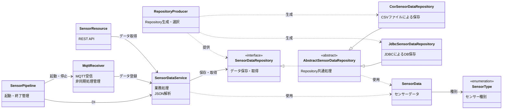
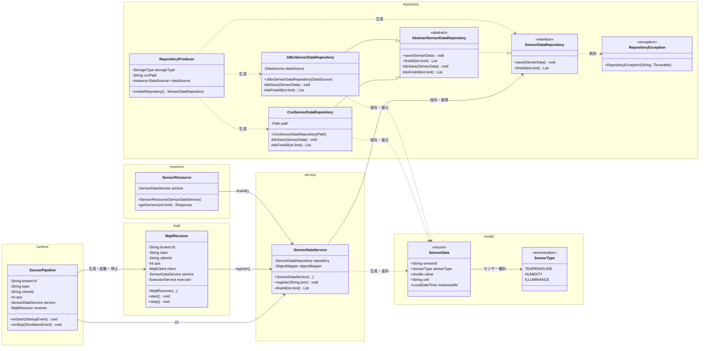

# 簡易版

```mermaid
classDiagram
direction LR

class SensorPipeline {
  起動・終了管理
}

class MqttReceiver {
  MQTT受信
  非同期処理管理
}

class SensorResource {
  REST API
}

class SensorDataService {
  業務処理
  JSON解析
}

class SensorDataRepository {
  <<interface>>
  データ保存・取得
}

class AbstractSensorDataRepository {
  <<abstract>>
  Repository共通処理
}

class CsvSensorDataRepository {
  CSVファイルによる保存
}

class JdbcSensorDataRepository {
  JDBCによるDB保存
}

class RepositoryProducer {
  Repository生成・選択
}

class SensorData {
  センサーデータ
}

class SensorType {
  <<enumeration>>
  センサー種別
}

SensorPipeline --> MqttReceiver : 起動・停止
SensorPipeline --> SensorDataService : DI
MqttReceiver --> SensorDataService : データ登録
SensorResource --> SensorDataService : データ取得
SensorDataService --> SensorDataRepository : 保存・取得
SensorDataRepository <|.. AbstractSensorDataRepository
AbstractSensorDataRepository <|-- CsvSensorDataRepository
AbstractSensorDataRepository <|-- JdbcSensorDataRepository
RepositoryProducer ..> CsvSensorDataRepository : 生成
RepositoryProducer ..> JdbcSensorDataRepository : 生成
RepositoryProducer ..> SensorDataRepository : 提供
SensorDataService ..> SensorData : 使用
AbstractSensorDataRepository ..> SensorData : 使用
SensorData --> SensorType : 種別
```

# 詳細版

```mermaid
classDiagram
direction LR

namespace runtime {
  class SensorPipeline {
    -String brokerUrl
    -String topic
    -String clientId
    -int qos
    -SensorDataService service
    -MqttReceiver receiver
    +onStart(StartupEvent) void
    +onStop(ShutdownEvent) void
  }
}

namespace mqtt {
  class MqttReceiver {
    -String brokerUrl
    -String topic
    -String clientId
    -int qos
    -MqttClient client
    -SensorDataService service
    -ExecutorService executor
    +MqttReceiver(...)
    +start() void
    +stop() void
  }
}

namespace resource {
  class SensorResource {
    -SensorDataService service
    +SensorResource(SensorDataService)
    +getSensors(int limit) Response
  }
}

namespace service {
  class SensorDataService {
    -SensorDataRepository repository
    -ObjectMapper objectMapper
    +SensorDataService(...)
    +register(String json) void
    +findAll(int limit) List
  }
}

namespace repository {
  class SensorDataRepository {
    <<interface>>
    +save(SensorData) void
    +findAll(int limit) List
  }

  class AbstractSensorDataRepository {
    <<abstract>>
    +save(SensorData) void
    +findAll(int limit) List
    #doSave(SensorData) void
    #doFindAll(int limit) List
  }

  class CsvSensorDataRepository {
    -Path path
    +CsvSensorDataRepository(Path)
    #doSave(SensorData) void
    #doFindAll(int limit) List
  }

  class JdbcSensorDataRepository {
    -DataSource dataSource
    +JdbcSensorDataRepository(DataSource)
    #doSave(SensorData) void
    #doFindAll(int limit) List
  }

  class RepositoryProducer {
    -StorageType storageType
    -String csvPath
    -Instance~DataSource~ dataSource
    +createRepository() SensorDataRepository
  }

  class RepositoryException {
    <<exception>>
    +RepositoryException(String, Throwable)
  }
}

namespace model {
  class SensorData {
    <<record>>
    +String sensorId
    +SensorType sensorType
    +double value
    +String unit
    +LocalDateTime measuredAt
  }

  class SensorType {
    <<enumeration>>
    TEMPERATURE
    HUMIDITY
    ILLUMINANCE
  }
}

SensorPipeline --> MqttReceiver : 生成・起動・停止
SensorPipeline --> SensorDataService : DI
MqttReceiver --> SensorDataService : register()
SensorResource --> SensorDataService : findAll()

SensorDataService --> SensorDataRepository : 保存・取得
SensorDataService ..> SensorData : 生成・返却

AbstractSensorDataRepository ..|> SensorDataRepository
CsvSensorDataRepository --|> AbstractSensorDataRepository
JdbcSensorDataRepository --|> AbstractSensorDataRepository

RepositoryProducer ..> SensorDataRepository : 生成
RepositoryProducer ..> CsvSensorDataRepository : 生成
RepositoryProducer ..> JdbcSensorDataRepository : 生成

CsvSensorDataRepository ..> SensorData : 保存・復元
JdbcSensorDataRepository ..> SensorData : 保存・復元

SensorData --> SensorType : センサー種別
SensorDataRepository ..> RepositoryException : 例外
```